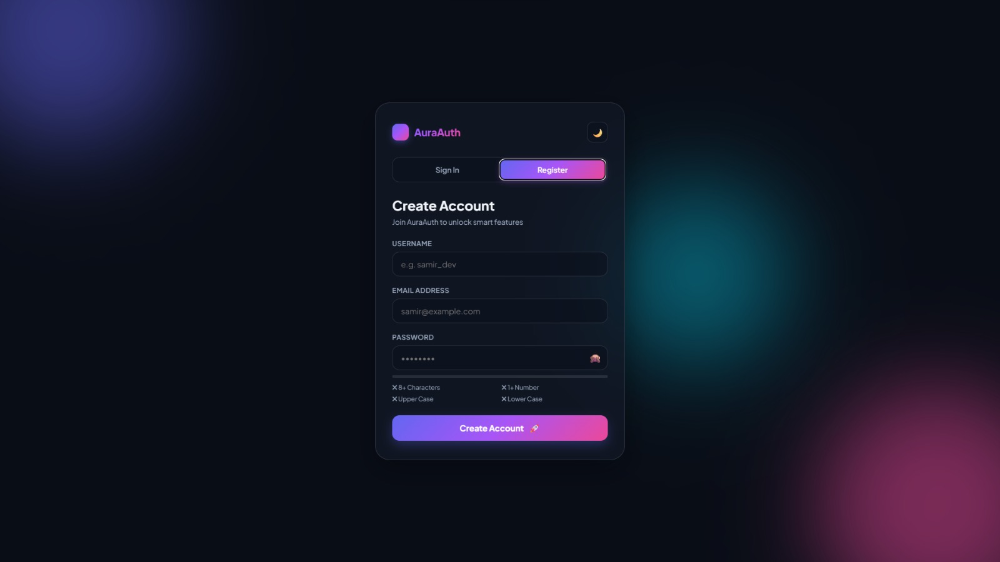
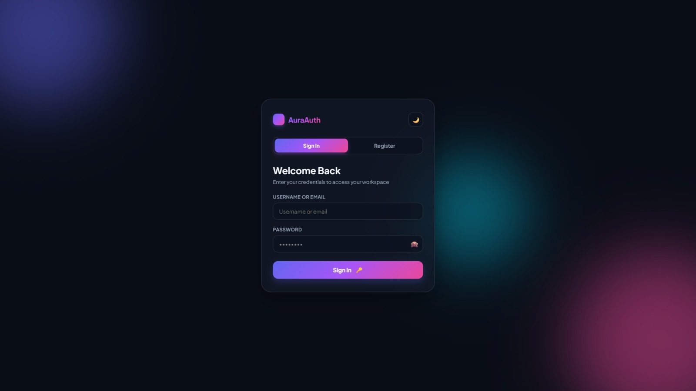

# ⚡ AuraAuth — Next-Gen Authentication & Dynamic Workspace


A modern, ultra-sleek, and lightweight client-side authentication interface built with pure **HTML5, CSS3, and Modern JavaScript (Vanilla JS)**. **AuraAuth** delivers a seamless user onboarding experience featuring smooth tab-switching animations, real-time security indicators, and an interactive personal workspace dashboard.

---

## 🌐 Live Demo

[🚀 View Live Website](https://next-gen-authentication.netlify.app/)

---

## 📸 Screenshot





---

## ✨ Key Features

- **🔄 Automatic Tab Redirection:** Seamlessly transitions from the **Register** view to the **Sign In** view immediately upon successful account creation, pre-filling the username for maximum UX efficiency.
- **🛡️ Real-Time Password Evaluator:** Live visual feedback tracking length, digits, and case-sensitive requirements with dynamic color indicators.
- **🔐 Client-Side SHA-256 Hashing:** Native Web Crypto API (`crypto.subtle`) hashes credentials into 64-character strings before local persistence.
- **🎨 Glassmorphism & Ambient Visuals:** Dynamic glassmorphic UI cards paired with floating background blob animations for a cutting-edge aesthetic.
- **🌓 Adaptive Theme Engine:** Instant Dark/Light mode toggle powered by smooth global CSS custom variables.
- **📊 Personalized Interactive Dashboard:** Displays account statistics, security health scores, login tracking, and unique avatar badges.
- **💡 Dynamic Inspiration Generator:** Built-in tech quote utility inside the workspace dashboard.
- **🔔 Toast Notification Engine:** Custom-built non-intrusive alerts for real-time status feedback (Success, Error, Info).

---

## ⚡ Feature Comparison

| Feature | Standard Forms | AuraAuth Engine |
| :--- | :---: | :---: |
| **Password Storage** | Plaintext / Raw | **Client-Side SHA-256 Hashed** |
| **User Redirection** | Manual Switch | **Automated Tab Transition** |
| **UI Aesthetics** | Flat / Static | **Glassmorphism & Animated Blobs** |
| **Dependencies** | Bootstrap / React | **Zero Dependencies (Pure Vanilla)** |
| **Real-time Rules** | Basic Check | **Dynamic Password Strength Bar** |

---

## 🔒 Security Architecture

```text
[User Password Input] ──► [SHA-256 Hash Engine (Web Crypto API)] ──► [64-Char Hash Generated]
                                                                                │
[User Authenticated]  ◄── [Compare Hash against Database] ◄── [Stored in LocalStorage]
