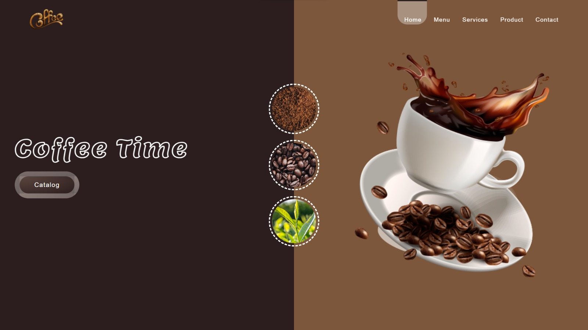

# ☕ Coffee Time — Landing Page

A beautifully crafted coffee-themed landing page featuring smooth CSS animations, a split-hero layout, and an interactive navigation slider. Built with pure HTML & CSS.

---

## 🖥️ Live Preview

> Upload to [GitHub Pages](https://pages.github.com/) or [Netlify](https://netlify.com/) to see it live!

---
---

## 📸 Screenshot



---

## ✨ Features

- **Animated Navbar** — Slides in from the top on load with a smooth underline slider that follows your hover
- **Split Hero Section** — Dark left panel with glowing title text + warm brown right panel with the coffee image
- **Floating Circles** — Three circular ingredient thumbnails (coffee powder, beans, leaves) centered between the two panels
- **CSS Keyframe Animations** — Fade-in, slide-in, logo rotate, and continuous text glow effects
- **Hover Interactions** — Button lift, image scale, and circle zoom on hover
- **Google Fonts** — Uses the *Lemon* cursive font for the main heading
- **Font Awesome Icons** — Ready to use throughout the page

---

## 📁 Project Structure

```
coffee-website/
│
├── index.html          # Main HTML file
├── style.css           # All styles and animations
│
├── logo.png            # Navbar logo
├── coffee split.png    # Hero right-side coffee image
├── coffee powder.jpg   # Circle 1 background
├── coffee beans.jpg    # Circle 2 background
└── leaves.jpg          # Circle 3 background
```

---

## 🚀 Getting Started

### 1. Clone the repository

```bash
git clone https://github.com/your-username/coffee-time.git
cd coffee-time
```

### 2. Add your images

Make sure these image files are in the root folder:

| File | Used For |
|------|----------|
| `logo.png` | Navbar logo |
| `coffee split.png` | Hero right panel image |
| `coffee powder.jpg` | First circle |
| `coffee beans.jpg` | Second circle |
| `leaves.jpg` | Third circle |

### 3. Open in browser

Just open `index.html` directly in any browser — no build step needed!

```bash
# Or with VS Code Live Server:
code .
# Then right-click index.html → "Open with Live Server"
```

---

## 🛠️ Built With

| Technology | Purpose |
|------------|---------|
| HTML5 | Structure & markup |
| CSS3 | Styling & animations |
| [Font Awesome 6](https://fontawesome.com/) | Icon library |
| [Google Fonts — Lemon](https://fonts.google.com/specimen/Lemon) | Heading typography |

---

## 🎨 Color Palette

| Color | Hex | Used For |
|-------|-----|----------|
| Dark Brown | `#2c1e1e` | Left hero panel, button |
| Warm Brown | `#7c573c` | Right hero panel |
| Muted Brown | `#5c4740` | Button gradient |
| Gold Accent | `#f6c177` | Nav hover color |
| Tan | `#d4a373` | Text glow effect |

---

## 📦 Deployment (GitHub Pages)

1. Push all files to a GitHub repository
2. Go to **Settings → Pages**
3. Under *Source*, select **main branch / root**
4. Your site will be live at: `https://your-username.github.io/coffee-time/`

---

## 📄 License

This project is open source and free to use for personal and educational purposes.

---

> Made with ❤️ and a lot of ☕
