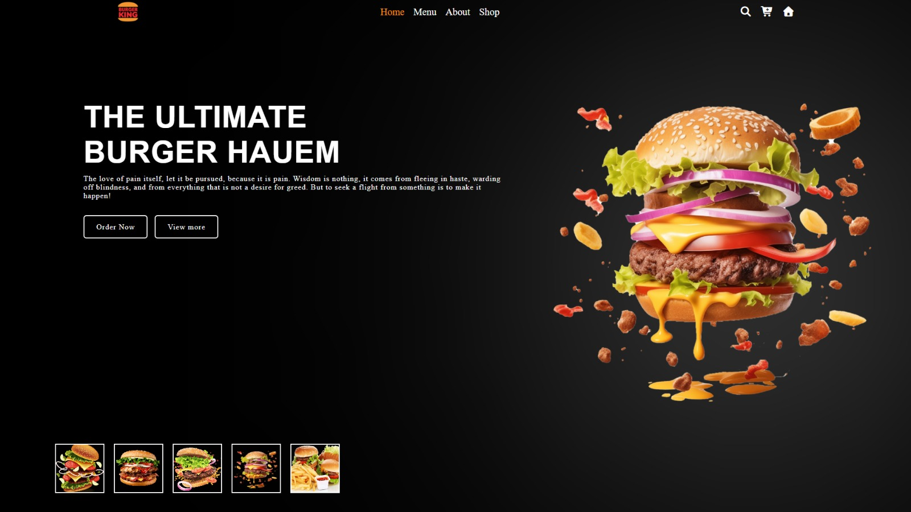

# 🍔 The Ultimate Burger Haven — Landing Page

> **OIBSIP Internship | Web Development & Designing | Level 1 · Task 1**


---

## 🌐 Live Preview

> _Add your GitHub Pages / Netlify link here after deployment_

---

## 📸 Screenshot



---

## 📋 About the Project

A visually polished **static landing page** for a fictional burger restaurant brand — **"The Ultimate Burger Haven"**. Built using HTML5, CSS3, and Vanilla JavaScript with a focus on smooth animations, a dark aesthetic, and an interactive burger image gallery.

---

## ✅ OIBSIP Task Checklist

| Requirement | Status |
|---|---|
| Fixed navigation bar with 3+ nav links | ✅ Done |
| Hero section with headline, subheadline, CTA buttons | ✅ Done |
| At least 2 distinct content sections | ✅ Done |
| Footer with contact/social links | ✅ Done |
| Consistent colour palette (Black + Orange) | ✅ Done |
| Responsive layout (Flexbox/Grid) | ✅ Done |
| No element overlap — proper spacing | ✅ Done |
| Clean typography with 2+ font sizes | ✅ Done |

---

## ✨ Features

- 🌟 **Animated star background** — 100 dynamically generated twinkling stars using JavaScript
- 🎬 **Smooth page animations** — fadeIn, slideInFromTop, slideInFromBottom, rotateIn via CSS keyframes
- 🍔 **Interactive burger gallery** — click any thumbnail to swap the main display image
- 🔶 **Orange hover effects** — nav links, buttons, and icons all have orange glow on hover
- 📱 **Fully responsive** — mobile-friendly layout using CSS Flexbox
- 🔤 **Font Awesome icons** — search, cart, and home icons in the navbar

---

## 🛠️ Tech Stack

| Technology | Usage |
|---|---|
| HTML5 | Page structure and semantic markup |
| CSS3 | Styling, animations, Flexbox layout |
| Vanilla JavaScript | Star generation, image toggle logic |
| Font Awesome 6.5 | Navbar icons |

---

## 📁 File Structure

```
WebDev-L1-LandingPage/
├── index.html          ← Main HTML file
├── style.css           ← All styles and animations
├── script.js           ← Star effect + burger image toggle
├── README.md           ← This file
└── screenshots/
    └── preview.png     ← Project screenshot
```

---

## 🚀 How to Run Locally

1. Clone the repository:
   ```bash
   git clone https://github.com/your-username/OIBSIP.git
   ```
2. Navigate to the project folder:
   ```bash
   cd OIBSIP/WebDev-L1-LandingPage
   ```
3. Open `index.html` in any modern browser.

> No dependencies or package installations required — pure HTML/CSS/JS.

---

## 🎨 Design Decisions

- **Black background** — creates a premium, modern restaurant feel
- **Orange (#FF8C00) accent** — energetic and appetising, associated with food brands
- **Star background** — adds a cinematic, high-end atmosphere
- **Fixed navigation** — keeps navigation accessible at all times

---

## 👤 Author

**Your Name**
- 🔗 LinkedIn: [Gazi Sayem Uddin Samir](https://www.linkedin.com/in/gazi-sayem-uddin-samir)
- 💻 GitHub: [SayemSamir](https://github.com/SayemSamir)

---

## 📹 Demo Video

> [▶ Watch the demo on LinkedIn](https://www.linkedin.com/posts/gazi-sayem-uddin-samir_oasisinfobyte-oibsip-webdevelopment-ugcPost-7484874162763681792-mSzA/?utm_source=share&utm_medium=member_desktop&rcm=ACoAAF69aJgBycCl3UD28ffhfZHCVmY1CjObAMA)

---

*Part of the Oasis Infobyte Summer Internship Program (OIBSIP) · #oasisinfobyte*
