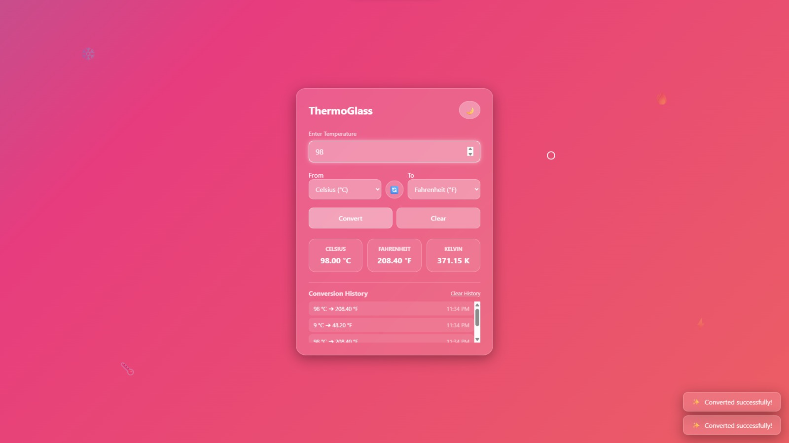
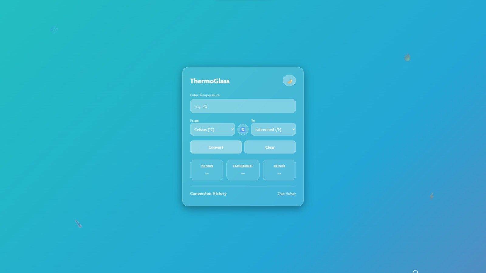

# 🌡️ Temperature Converter Website

# 🌡️ Temperature Converter

### Oasis Infobyte Internship - Level 1 Task 3

Convert temperatures instantly between

🔥 Celsius

❄️ Fahrenheit

🌍 Kelvin

---

---

# 📖 About

This project is a responsive Temperature Converter developed using HTML, CSS, and Vanilla JavaScript as part of the Oasis Infobyte Internship Program.

Users can instantly convert temperatures between Celsius, Fahrenheit, and Kelvin with proper input validation and absolute zero checking.

---

# ✨ Features

✅ Celsius to Fahrenheit

✅ Fahrenheit to Celsius

✅ Celsius to Kelvin

✅ Kelvin to Celsius

✅ Fahrenheit to Kelvin

✅ Kelvin to Fahrenheit

✅ Input Validation

✅ Absolute Zero Validation

✅ Responsive Design

✅ Modern UI

---

# 🖼️ Preview

## Home

---

# 🚀 Live Demo

🌐 Live Website

[🚀 View Live Website](https://thermoglass.netlify.app/)

---

# 🎥 Demo Video

LinkedIn Post

https://linkedin.com/......

---

# 📂 Folder Structure

Temperature-Converter/
│
├── index.html
├── style.css
├── script.js
├── README.md
├── screenshot/
│   ├── 1.jpeg
│   ├── 2.jpeg
│   └── 3.jpeg

---

# 🛠️ Technologies

HTML5

CSS3

JavaScript

Google Fonts

Font Awesome

---

## 🌡️ Temperature Conversion Formulas

| Conversion | Formula |
|------------|---------|
| 🔥 Celsius ➜ Fahrenheit | **°F = (°C × 9 ÷ 5) + 32** |
| ❄️ Fahrenheit ➜ Celsius | **°C = (°F − 32) × 5 ÷ 9** |
| 🌍 Celsius ➜ Kelvin | **K = °C + 273.15** |
| 🌍 Kelvin ➜ Celsius | **°C = K − 273.15** |
| 🔥 Fahrenheit ➜ Kelvin | **K = (°F − 32) × 5 ÷ 9 + 273.15** |
| ❄️ Kelvin ➜ Fahrenheit | **°F = (K − 273.15) × 9 ÷ 5 + 32** |
---
## ✨ Features

| 🚀 | Feature |
|----|---------|
| ✅ | Instant Temperature Conversion |
| ✅ | Celsius, Fahrenheit & Kelvin |
| ✅ | Input Validation |
| ✅ | Absolute Zero Detection |
| ✅ | Responsive Layout |
| ✅ | Modern Glassmorphism UI |
| ✅ | Smooth Hover Animations |
| ✅ | Clean User Experience |
| ✅ | Error Messages |
| ✅ | Mobile Friendly |
# ⚠️ Input Validation

✔ Numbers only

✔ No empty input

✔ Absolute Zero Checking

✔ Friendly Error Messages

---

# 📱 Responsive

Desktop

Laptop

Tablet

Mobile

---

Made with ❤️ by **Gazi Sayem Uddin Samir**

[🌐 Portfolio](https://thermoglass.netlify.app/)  [💼 LinkedIn](https://linkedin.com/in/gazi-sayem-uddin-samir)  [💼 💻 GitHub](https://github.com/SayemSamir)  

---

### ⭐ If you like this project

Give this repository a ⭐

It motivates me to build more awesome projects.

